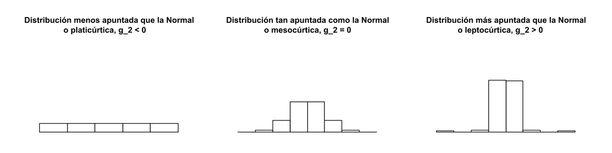

# Modelización

## 1. Datos

Los **datos** son los hechos que tenemos disponibles con respecto a un contexto de negocio. Están compuestos por:
   * **Objetos**: persona, árbol, animal, etc
   * **Atributos** (variables): altura, edad, peso, coste, etc

Existen 2 tipos de variables según los datos que almacenan:
   * **Continuas** o cuantitativas (variables numéricas): cualquier valor numérico positivo o negativo dado en un rango.
   * **Discretas** o cualitativas (variables categóricas): pueden tomar únicamente valores particulares: ciudad, color, etc.

### Escalas de medida
Las variables pueden medirse en 4 escalas de medida:

1. Escala de medida **ordinal**: Se utiliza cuando las categorías implican orden. Por ejemplo la nota de un examen de 1 a 10 o una review de 1 a 5. 

2. Escala de medida **nominal**: Los datos se clasifican como categorías discretas. Permite calcular la proporción (número de ocurrencias de cada tipo de categoría / total de ocurrencias). Por ejemplo el color de pelo.

3. Escala de **intervalo** de medida: cuando la diferencia entre los valores tiene significado se crean intervalos. Por ejemplo el IQ: 85 - 114, 115 - 129, 130 -144...

4. Escala de **proporción** de medida: La diferencia entre los datos tiene significado y además se relaciona con un punto cero: Edad, Peso, Altura. Es la escala más común y que más operaciones nos permite a nivel matemático y de estadística descriptiva.

### Facetas de los datos

* **Estructurados**: datos que dependen de un modelo de datos y residen en un campo fijo dentro de un registro. Es fácil almacenar datos estructurados en tablas dentro de bases de datos o archivos de Excel. SQL, o lenguaje de consulta estructurado, es la forma preferida de administrar y consultar los datos que residen en las bases de datos.

* **No estructurados**: datos que no son fáciles de encajar en un modelo de datos porque el contenido es específico del contexto o variable. Un ejemplo de datos no estructurados es su correo electrónico habitual.

* **Lenguaje natural**: El lenguaje natural es un tipo especial de datos no estructurados; es un desafío de procesar porque requiere conocimiento de técnicas y lingüística específicas de ciencia de datos.

- **Datos generados por máquinas**: son información creada automáticamente por una computadora, un proceso, una aplicación u otra máquina sin intervención humana. 

- **Multimedia**: El audio, la imagen y el video son tipos de datos que plantean desafíos específicos para un científico de datos. Las tareas que son triviales para los humanos, como reconocer objetos en imágenes, resultan ser un desafío para los ordenadores.

- **Streaming**: Los datos en streaming fluyen hacia el sistema cuando ocurre un evento en lugar de cargarse en un almacén de datos en un lote o batch. 
	- Aunque este no es realmente un tipo diferente de datos, lo tratamos como tal porque necesita adaptar su proceso para manejar este tipo de información. Los datos de streaming son datos que se generan continuamente por miles de orígenes de datos, que normalmente envían los registros de datos simultáneamente, y en tamaños pequeños (del orden de Kilobytes).

- **Datos de gráfico**:  "Gráfico" en este caso apunta a la teoría matemática de grafos. En la teoría de grafos, un gráfico es una estructura matemática para modelar relaciones por pares entre objetos. Los datos de gráficos o redes son, en resumen, datos que se centran en la relación o adyacencia de los objetos. Las estructuras gráficas usan nodos, bordes y propiedades para representar y almacenar datos gráficos.

## 2. Big Data

Se habla de Big Data cuando tenemos:
* Alto volumen de datos
* Tasa de crecimiento alta en los datos
* Información estructurada, semiestructurada y no estructurada
* Procesamiento y almacenamiento en arquitecturas distribuidas y paralelizadas
* Necesidad de grandes recursos computacionales: proveedores Cloud: GCP, AWS, Oracle Cloud, OVHcloud, Digital Ocean, IBM.

Fuentes de datos:

* Bases de datos (Ver [ranking](https://db-engines.com/en/ranking))
* Data warehouse
* Data lake
* Data lake house
* Repositorios
* Información web
* Sensores y dispositivos IoT
* Social media

## 3. Inteligencia Artificial
Disciplina científica que se ocupa de crear programas informáticos que ejecutan operaciones comparables a las que realiza la mente humana, para ello emplea diferentes áreas de conocimiento.

Una máquina es considerada inteligente si puede conseguir un rendimiento igual al de un humano en una tarea cognitiva.

Rama de la informática que estudia la creación de agentes computacionales que reciben estímulos externos, y, en base a ellos y a un conocimiento almacenado en dicho agente, producen resultados o acciones que maximizan una medida de rendimiento.

El conocimiento almacenado puede ser aprendido por el mismo agente utilizando técnicas de aprendizaje automático o puede ser incorporado por un humano experto en el dominio específico.

Ramas de la inteligencia artificial:

* Procesamiento de lenguaje natural
* Sistemas expertos
* Visión por computador
* Robótica
* Voz
* Planificación y optimización
* Aprendizaje automático (Machine Learning)
    * Aprendizaje Supervisado
        * Clasificación
        * Regresión
    * Aprendizaje No supervisado
        * Clustering
        * Asociación
        * Reducción de la dimensionalidad
    * Aprendizaje Reforzado
	* Aprendizaje profundo

## 4. Grados de inteligencia

### 1. Estadística
El origen de la palabra estadística se remonta a la palabra latina “Status” (“consejo de estado”) o la palabra italiana “Statista” (“estadista” o “político”); es decir, el significado de estas palabras es “Estado Político” o Gobierno.

A principios del siglo XIX, la estadística adquirió el sentido de la recopilación y clasificación de datos.

Por lo tanto, el propósito fundamental del nacimiento de la estadística se centró en los datos que utilizarían el gobierno y las organizaciones administrativas centralizadas para recopilar datos censales sobre la población de los estados y localidades.

Los datos se describen por medio de la estadística descriptiva.

El término “estadística descriptiva” se refiere al análisis, el resumen y la presentación de los resultados relacionados con un conjunto de datos derivados de una muestra o de toda la población.

#### Medidas de centralización
Para representar un conjunto de datos como un resumen de 1 número (el punto medio de la distribución de los datos), usamos una **medida de tendencia central**. Existen tres medidas de tendencia central, es decir, Media, Mediana y Moda.

* **Media**: La media, también representada por la letra griega “μ”, es el promedio de un conjunto de valores, o su distribución: 
	* Para calcular la media de un grupo de números, debemos sumarlos y dividirlos por la cantidad de números que hay.
	* Para las distribuciones con sesgo, la media no es necesariamente el mismo valor que la mediana o que la moda.
	
* **Mediana**: es el valor que se quedaría en el centro de un conjunto de datos si ordenáramos estos de mayor a menor (o viceversa). 
	* Es decir, es el valor que deja el mismo número de datos tanto a su izquierda como a su derecha.
	* Esta medida es de suma importancia si los valores de los individuos están muy concentrados en torno al máximo o al mínimo, en lo que se conoce como asimetría, ya que da una idea de la tendencia central mucho más robusta que la media.

* **Moda**: de un conjunto de datos se define como el valor que más se repite en dicho conjunto. La frecuencia de ocurrencia de cada punto de datos en los datos, y el que tiene la frecuencia más alta es la moda de los datos. Esta medida también se puede utilizar cuando los datos no son numéricos.

#### Medidas de dispersión
Las medidas de dispersión, como su propio nombre indica, miden cómo de dispersos o separados están los datos entre sí. Más concretamente, miden cuánto se suelen alejar de los valores centrales.

* **Rango**: El rango es la resta del valor máximo que toman nuestros datos menos el valor mínimo.

* **Varianza**: representa la variabilidad de una serie de datos respecto a su media. Representada normalmente como σ2, se define como la suma del cuadrado de las desviaciones de cada valor con respecto a la media, dividido entre el nº de valores que tenemos. 
	* Restamos a cada dato la media aritmética, lo elevamos al cuadrado y repetimos para el siguiente dato, así tantas veces como datos/observaciones tengamos. Una vez realizado, hacemos la suma, y esa suma la dividimos entre el número de observaciones.

* **Desviación típica o estándar**: la raíz cuadrada de la varianza. El problema de la varianza es que, dado que las hemos elevado al cuadrado para que el cálculo tenga sentido, el valor resultante va a tener una magnitud también elevada al cuadrado. Para evitar estos problemas, podemos hacer uso de la desviación típica: al hacer la raíz cuadrada, obtenemos una cifra que ya sí que se corresponde en magnitud con nuestros datos.

Lo ideal es que estas medidas sean lo más pequeñas posible (lo que equivaldría a tener datos más próximos entre sí, numéricamente hablando), para que así las medidas de centralización describan mejor a los datos, que a fin de cuentas es el objetivo de la estadística descriptiva: describir cosas.

#### Medidas de forma
Las medidas de forma, como su propio nombre indica, nos otorgarán una idea sobre la forma en la que se distribuyen los datos en un conjunto: si están más cerca del máximo, del mínimo, o por el contrario son simétricos, etc.

La **simetría** es la característica que se da cuando un conjunto de datos está formado por pares de valores, siendo los valores de cada par equidistantes a la media del conjunto. En otras palabras, sería como colocar un espejo en la abscisa (valor del eje X) de la media aritmética que reflejara la distribución a un lado y la imprimiera al otro de forma invertida.

La **asimetría** se define como la falta de simetría de un conjunto de datos. Puede estar debida a que haya muchos valores a la izquierda (asimetría a derechas/positiva) o que los haya a la derecha (asimetría a izquierdas/negativa). Esta asimetría definirá el orden de la media aritmética, la moda y la mediana de la distribución.

La **curtosis** (que podría traducirse del griego como curvatura o arqueamiento) es una medida que trata de ver el nivel de apuntamiento de una distribución, que debe ser siempre unimodal y simétrica. Sería algo así como ver el nivel en el que un conjunto de datos es más o menos “puntiagudo”.

#### Medidas de concentración

Las **medidas de concentración** nos indican el grado de desigualdad existente en el reparto de valores de un conjunto, suponiendo que éstos son no negativos.

* **Coeficiente de Gini** o **Coef. de Lorenz**: Este coeficiente toma valores entre 0 y 1. 
	* El 0 correspondería al caso en el que todos los datos tomaran el mismo valor (todos los datos fuesen iguales).
	* El 1 correspondería al caso en el que todos los datos tomasen el valor 0 salvo uno, que sería el que concentraría el total del conjunto. Este sería el caso de máxima desigualdad.

### 2. Machine Learning
El Machine Learning hace referencia a la creación y el uso de modelos que se aprenden de los datos. 

modelo = algoritmo + datos

En otros contextos, esto podría llamarse modelado predictivo o minería de datos, pero el concepto es el mismo: Machine Learning o aprendizaje automático. 

### 3. Análisis de datos
Tradicionalmente, las empresas tomaban decisiones basadas en experiencias pasadas o reglas empíricas, o había otros aspectos cualitativos en la toma de decisiones; sin embargo, esto cambió con el desarrollo de almacenes de datos y sistemas de planificación de recursos empresariales (ERP). 

Las empresas consideraron los datos y se basaron en análisis ad hoc para afirmar sus suposiciones basadas en la experiencia/conocimiento para decisiones comerciales críticas y diarias. Esto evolucionó a medida que la inteligencia comercial basada en datos o el análisis comercial para el proceso de toma de decisiones fue adoptado rápidamente por organizaciones y empresas de todo el mundo. 

Hoy en día, las empresas de todos los tamaños utilizan análisis. A menudo, la palabra "Análisis de negocios" (Business Analytics) se usa indistintamente para "Análisis de datos" (Data Analytics) en el mundo corporativo. 

Para que las empresas tengan una visión holística del mercado y de cómo una empresa compite de manera eficiente dentro de ese mercado para **aumentar el ROI** (Retorno de la inversión), requiere un entorno analítico sólido en torno al tipo de análisis que es posible. 

Hay 4 cuatro tipos de análisis: 

* Análisis descriptivo: Qué ha pasado? (Reportes)
* Análisis diagnóstico: Por qué pasó? (Análisis ad-hoc)
* Análisis predictivo: Qué va a pasar? (Predicción)
* Análisis prescriptivo: Cómo hacer que suceda lo mejor? (Optimización)

El Machine Learning o aprendizaje automático pretende implementar el análisis descriptivo y predictivo por medio de la explotación de datasets y el modelado.

### 4. Ciencia de datos

El auge de Internet aumenta drásticamente el volumen de información estructurada,
datos semiestructurados y no estructurados. Esto condujo al nacimiento del término "Big Data" caracterizado por 3V, que significa Volumen, Variedad y Velocidad. Se requieren herramientas y sistemas especiales para procesar grandes volúmenes de datos, con una amplia Variedad (texto, número, audio, video, etc.), generados a alta velocidad.

La revolución de los grandes datos influyó en el nacimiento del término "ciencia de datos". Aunque el término “ciencia de datos” surgió a partir de 1960, se popularizó y esto se atribuye a Jeff Hammerbacher y DJ Patil, de Facebook y LinkedIn, porque lo eligieron cuidadosamente, tratando de describir sus equipos y trabajo (según Building Data Science Teams de DJ Patil publicado en 2008); se decidieron por "científico de datos", estando de moda desde entonces.

La ejecución de proyectos de ciencia de datos requiere tres habilidades clave:
1. Habilidades de programación
2. Matemáticas y Estadística
3. Experiencia en la materia o temática a la que pertenecen los datos

Lo que podemos aprender de la historia y la evolución de los conceptos en torno al aprendizaje de 'Datos' es que, aunque utilizan los mismos métodos, evolucionaron como culturas diferentes, por lo que tienen diferentes historias, nomenclatura, notación y perspectivas filosóficas. Siendo el orden de evolución el siguiente:

1. Estadística
2. Machine Learning / Data Mining
3. Data Analytics
4. Ciencia de datos

## 5. Ciencia de datos

![[data-science.png]]

1. Definir los objetivos del proyecto: Un proyecto comienza por comprender el qué, el por qué y el cómo. El resultado debe ser:
	* Un objetivo claro de investigación
	* La misión y el contexto del proyecto, exponer el problema de negocio a resolver
	* Cómo se van a realizar los análisis
	* Qué recursos se necesitan: software, hardware, personas
	* Prueba de que es un proyecto realizable, o proof of concept (POC)
	* Entregables y una medida del éxito
	* Fechas de entrega o deadlines

2. Obtención de los datos requeridos:
	* Datos internos generados por los procesos internos de la empresa
	* Datos externos públicos y gratuitos
	* Datos externos de pago

3. Limpieza, integración y transformación de datos:
	* Sanitizar y preparar los datos para su uso en la fase de modelado y generación de informes. Esta fase es la más importante porque el funcionamiento de los modelos dependerá de ello.
	* Comprobación y corrección de errores de datos, enriquecimiento de los datos con datos de otras fuentes de datos y transformación a un formato adecuado para los modelos.

4. Análisis exploratorio de datos
	* La información se vuelve mucho más fácil de captar cuando se muestra en una imagen, por lo tanto, se utilizan principalmente técnicas gráficas para comprender los datos y las interacciones entre las variables.
	* El objetivo no es limpiar los datos, pero es común que se descubran anomalías que se pasaron por alto en la fase anterior, lo que obliga a dar un paso atrás y corregirlas.
	* Profundizar en los datos utilizando estadísticas descriptivas y técnicas visuales.

5. Construcción de los modelos (Modelización)
	* Con datos limpios y una buena comprensión del contenido, se empieza a crear modelos con el objetivo de hacer mejores predicciones, clasificar objetos o comprender el sistema que está modelando. 
	* Esta fase está mucho más enfocada que el paso de análisis exploratorio, porque sabe lo que está buscando y cuál quiere que sea el resultado.
	* Uso de aprendizaje automático y técnicas estadísticas para lograr el objetivo del proyecto.

6. Presentación de resultados y construcción de aplicaciones sobre los mismos
	* Presentación de sus resultados a las partes interesadas e industrialización de su proceso de análisis para la reutilización repetitiva y la integración con otras herramientas. Ejemplo: Despliegue de un modelo que sirva predicciones a través de un API REST.

Nota: el Machine learning o aprendizaje automático se origina a partir de la inteligencia artificial. No es una rama de la ciencia de datos, es una herramienta más utilizada por la ciencia de datos.

## 6. Modelización

¿Qué es un modelo? Es simplemente la especificación de una relación matemática que existe entre diferentes variables.

La definición de modelo hace referencia a un "sistema de hechos, datos e inferencias presentados como una descripción matemática de una entidad o estado de cosas". 

El Machine Learning hace referencia a la creación y el uso de modelos que se aprenden de los datos. En otros contextos, esto podría llamarse modelado predictivo o minería de datos, pero el concepto es el mismo: Machine Learning o aprendizaje automático. 

![[machine-learning.png]]

Por lo general, nuestro objetivo será usar datos existentes para desarrollar modelos que podamos usar para predecir varios resultados para nuevos datos, como:

* Si un mensaje de correo electrónico es spam o no
* Si una transacción con tarjeta de crédito es fraudulenta
* En qué anuncio es más probable que haga clic un comprador
* ¿Qué equipo de fútbol va a ganar el mundial?

Aunque el **Machine Learning** está vinculado principalmente a la fase de construcción de modelos en proceso de ciencia de datos, se puede utilizar en casi todas las fases:

* En la fase de **preparación de datos**: un ejemplo sería limpiar una lista de cadenas de texto; el aprendizaje automático puede agrupar cadenas similares para que sea más fácil corregir errores ortográficos.

* En la fase de **exploración de datos**: los algoritmos pueden eliminar patrones subyacentes en los datos donde serían difíciles de encontrar solo con gráficos.

Nota: la misma palabra "modelo" puede referirse a:
* un tipo de modelo (p. ej., regresión lineal)
* una arquitectura de modelo completamente especificada (p. ej., regresión lineal con una entrada y una salida)
* el modelo final entrenado listo para usarse para predicciones (p. ej., regresión lineal con una entrada y una salida, utilizando valores específicos )

## 7. Proceso de modelización
La fase de modelado consta de cuatro pasos:

1. Ingeniería de características y selección del modelo
2. Entrenamiento del modelo
3. Validación y selección del modelo
4. Aplicación del modelo entrenado a datos no vistos

Antes de encontrar un buen modelo, probablemente haya que iterar entre los tres primeros pasos. 

El último paso no siempre está presente porque a veces el objetivo no es la predicción sino la explicación (análisis de causa raíz). Por ejemplo, es posible que desee averiguar las causas de las extinciones de especies, pero no necesariamente predecir cuál es la próxima en extinguirse. 

Es posible encadenar o combinar múltiples técnicas. Cuando se encadenan varios modelos, la salida del primer modelo se convierte en una entrada para el segundo modelo. 

Cuando se combinan varios modelos, los entrena de forma independiente y combina sus resultados. Esta última técnica también se conoce como aprendizaje conjunto. 

Un **modelo** consiste en:
* Entrada: construcciones de información llamadas **características / variables / predictores / features**
* Salida: un objetivo / variable de respuesta / target.

El objetivo de un modelo es predecir la **variable target**, por ejemplo, la temperatura alta de mañana. Las variables que lo ayudan a hacer esto y que (generalmente) conoce son las características o **variables predictoras**, como la temperatura actual, los movimientos de las nubes, la velocidad actual del viento, etc. 

Los mejores modelos son aquellos que representan con precisión la realidad, preferiblemente sin dejar de ser concisos e interpretables. Para lograr esto, la ingeniería de características (feature engineering) es la parte más importante y posiblemente la más interesante del modelado. 

### 1. Ingeniería de características y selección del modelo
Con la ingeniería de características (feature engineering), se deben crear posibles predictores o variables para el modelo. Este es uno de los pasos más importantes del proceso porque un modelo recombina estas características para lograr sus predicciones. 

A menudo, es posible tener que consultar a un experto o la literatura adecuada para encontrar características más significativas. Ciertas características son las variables que obtiene de un conjunto de datos o dataset interno o externo. 

En la práctica, debemos encontrar las features por nosotros mismos, que pueden estar dispersas entre diferentes datasets. Es posible tener que reunir más de 20 fuentes de datos diferentes antes de tener los datos sin procesar que se necesitan. 

A menudo, será necesario aplicar una transformación a una entrada antes de que se convierta en un buen predictor o combinar varias entradas. Un ejemplo de combinación de entradas múltiples serían las variables de interacción: el impacto de cualquiera de las variables individuales es bajo, pero si ambas están presentes, su impacto se vuelve inmenso. Esto es especialmente cierto en entornos químicos y médicos. 

A veces es necesario utilizar técnicas de modelado para derivar características: el resultado de un modelo se convierte en parte de otro modelo. Esto es muy común, especialmente en la minería de textos.

#### Sesgo de disponibilidad

Uno de los mayores errores en la construcción de modelos es el **sesgo de disponibilidad**: se usa como características solo las que podría tener fácilmente a mano y, en consecuencia, su modelo representa esta única "verdad". Los modelos que sufren de sesgo de disponibilidad a menudo fallan cuando se validan porque queda claro que no son una representación válida de la verdad. Ejemplo:

1. En la Segunda Guerra Mundial, después de los bombardeos en territorio alemán, muchos de los aviones ingleses regresaron con agujeros de bala en las alas, alrededor de la punta y cerca de la cola del avión. Casi ninguno de ellos tenía agujeros de bala en la cabina, el timón de cola o el bloque del motor.
2. Ingeniería decidió que se debía agregar un blindaje adicional a las alas. Esto parecía una buena idea hasta que un matemático de nombre Abraham Wald explicó la obviedad de su error: solo tenían en cuenta los aviones que regresaban. Los agujeros de bala en las alas eran en realidad lo que menos les preocupaba, porque al menos un avión con este tipo de daño podría regresar a casa para ser reparado. 
3. Por lo tanto, se incrementó la fortificación de los aviones en los lugares que quedaron ilesos en los aviones que regresaban. El razonamiento inicial sufría de sesgo de disponibilidad: los ingenieros ignoraban una parte importante de los datos porque eran más difíciles de obtener. En este caso tuvieron suerte, porque se podía invertir el razonamiento para obtener el resultado deseado sin obtener los datos de los aviones estrellados.

Una vez creadas las características iniciales, se puede entrenar un modelo.

### 2. Entrenamiento del modelo

Con los predictores correctos en su lugar y una lista de técnicas de modelado en mente, se puede avanzar al entrenamiento de modelos. En esta fase el modelo aprende los datos del dataset.

Las técnicas de modelado más comunes tienen implementaciones listas para la industria en casi todos los lenguajes de programación, incluido Python. Esto permite crear y entrenar modelos ejecutando muy pocas líneas de código. Para realizar técnicas de ciencia de datos muy sofisticadas, será necesario trabajar a más bajo nivel, haciendo cálculos matemáticos e implementándolos con un lenguaje de programación. 

Una vez entrenado un modelo, se debe extrapolar a la realidad, lo que comúnmente se conoce como validación del modelo.

### 3. Validación y selección del modelo

La ciencia de datos tiene muchas técnicas de modelado, y la pregunta es cuál es la adecuada para usar. 

Un buen modelo tiene dos propiedades: 

* Tiene un buen poder predictivo
* Generaliza bien los datos que no ha visto: El término "generalización" se refiere a la capacidad del modelo para adaptarse y reaccionar adecuadamente a nuevos datos nunca antes vistos, que se han extraído de la misma distribución que la utilizada para construir el modelo. En otras palabras, la generalización examina qué tan bien un modelo puede digerir nuevos datos y hacer predicciones correctas después de entrenarse en un conjunto de entrenamiento.

#### Medidas de error

Para lograr esto, se define una medida de error (cuán equivocado está el modelo) y una estrategia de validación. Dos medidas de error comunes en el aprendizaje automático son:

* En problemas de **clasificación**: la tasa de error de clasificación. Es el porcentaje de observaciones en el conjunto de datos de prueba que su modelo etiquetó incorrectamente; más bajo es mejor.

* En problemas de **regresión**: error cuadrático medio. Mide qué tan grande es el error promedio de su predicción. Elevar al cuadrado el error promedio tiene dos consecuencias: no se puede cancelar una predicción incorrecta en una dirección con una predicción defectuosa en la otra dirección. Por ejemplo, sobreestimar la facturación futura del próximo mes en 5000 no cancela la subestimación en 5000 para el mes siguiente. Como segunda consecuencia de la elevación al cuadrado, los errores más grandes tienen incluso más peso del que tendrían de otro modo. Los errores pequeños siguen siendo pequeños o incluso pueden reducirse (si <1), mientras que los errores grandes se agrandan y definitivamente llamarán la atención para que podamos corregirlos. 

Estas son solo algunas de las posibles medidas de error, pero existen muchas más técnicas en función del tipo de modelo y se suelen revisar todas para sacar una conclusión definitiva.

#### Estrategias de validación

Existen muchas estrategias de validación, entre las que se incluyen:

* Validación train-test: dividir sus datos en un conjunto de entrenamiento con X% de las observaciones y mantener el resto como un conjunto de datos de test o validación (un conjunto de datos que nunca se usa para la creación de modelos): esta es la técnica más común. Se suele dividir 90-10, 80-20, 70-30.

* Validación cruzada de k-fold: esta estrategia divide el conjunto de datos en k partes y usa cada parte una vez como un conjunto de datos de prueba mientras usa las otras como un conjunto de datos de entrenamiento. Esto tiene la ventaja de que utiliza todos los datos disponibles en el conjunto de datos.

* Leave 1 out: este enfoque es el mismo que el de k-fold pero con k=1. Siempre dejas una observación fuera y entrenas con el resto de los datos. Esto se usa solo en conjuntos de datos pequeños.

La validación es extremadamente importante porque determina si un modelo funciona en condiciones de la vida real. Para ello es recomendable probar los modelos con datos que el modelo construido nunca haya visto y asegurarse de que estos datos sean una representación real de lo que se encontraría cuando se aplicara en escenarios reales. 

### 4. Aplicación del modelo entrenado a datos no vistos

Una vez aplicados los primeros tres pasos con éxito, obtenemos un modelo de rendimiento que generaliza ante datos no vistos. 

El proceso de aplicar el modelo a nuevos datos se denomina model scoring o inferencia. De hecho, el model scoring es algo realizado implícitamente durante la validación en la fase anterior, solo que ahora no se sabe el resultado correcto porque los datos son nuevos. Llegados a este punto se debería confiar lo suficiente en el modelo como para usarlo de verdad.

El model scoring consta de dos pasos.

1. Se prepara un conjunto de datos que tiene características exactamente como las define el modelo. Esto se reduce a repetir la preparación de datos que se realizó en el paso uno del proceso de modelado, pero para un nuevo conjunto de datos. 
2. Se aplica el modelo en este nuevo conjunto de datos, y esto da como resultado una predicción. 

## 8. Tipos de modelos según supervisión

![[newplot.png]]

Hay distintos tipos de sistemas de Machine Learning que es útil clasificarlos en categorías amplias, según los siguientes criterios:

* Cómo son de **supervisados o no supervisados** durante el entrenamiento:
	1. **Aprendizaje supervisado**: intentan discernir los resultados y aprender tratando de encontrar patrones en un conjunto de datos etiquetados. Se requiere interacción humana para etiquetar los datos.
	2. **Aprendizaje no supervisado**: no se basan en datos etiquetados e intentan encontrar patrones en un conjunto de datos sin interacción humana.
	3. **Aprendizaje semi-supervisado**: necesitan datos etiquetados y, por lo tanto, interacción humana para encontrar patrones en el conjunto de datos, pero aún pueden progresar hacia un resultado y aprender incluso si también pasan datos no etiquetados.
	
* Si pueden o no **aprender gradualmente** sobre la marcha:
	* aprendizaje en batch
	* aprendizaje incremental 

### 1. Aprendizaje supervisado

- **Algoritmos supervisados** (predictivos): predicen un dato — PREDICCIONES
    - Regresión — variable **continua**
        - Regresión variable
        - Regresión lineal
        - Regresión lineal multivariable
        - Regresión polinómica
        - Árbol de decisión

    - Clasificación — variable **discreta**
        - Regresión logística
        - Análisis discriminante o algoritmo de discriminación generativo (GDA)
        - Árbol de decisión
        - Naive-Bayes (Filtro de SPAM)
        - SVMs (Support Vector Machines)

#### Regresión

Trabajan con datos continuos o cuantitativos

Responden a las preguntas:

* Cuánto?
* Cuántos?

Casos de uso:

* Retail: Cuántas serán las ventas diarias/mensuales/anuales de una tienda los próximos años?
* Retail: Cuántas plazas de garaje deben asignarse para un centro comercial?
* Energía: Cuál será la temperatura para los próximos 5 días?
* Seguros: Cuántos cliente reclamarán el seguro este año?
* Bancos: Cuál es el credit score de un cliente?
* Predecir la cantidad de dinero que una persona gastará en el producto X (regresión)
* Predecir el número de erupciones de un volcán en un período (regresión)
* Predicción de los ingresos anuales de su empresa (regresión)

Los algoritmos de regresión estudian la relación entre las diferentes variables que son relevantes para responder las preguntas que se estudian.

Evaluar el rendimiento de modelos lineales:

* R-squared (r2_score)
* RMSE (mean_absolute_error)
* MAE (mean_squared_error)
  

Regresión polinómica:
* cuadrática
* cúbica
* Nth
  
Regresión multivariante:
* Una variable dependiente y múltiples variables independientes

Preprocesado de datos, manejar variables categóricas:
* Label Binarizer
* Label Encoder
* One Hot Encoder
  
Multicolinealidad es un incidente en el que una o más variables independientes están fuertemente correlacionadas entre ellas. Cuando esto ocurre solo se debe usar una de ellas.

VIF es un indicador que permite medir la existencia de Multicolinealidad.

En la regresión multivariante aumenta el R-squared debido a la presencia de más variables independientes, por tanto se usa el R-squared ajustado.

Evaluar regresión:

* Outliers: impactan en la precisión del modelo.
* Homocedasticidad: si el error cometido por el modelo tiene siempre la misma varianza
* Over fitting y under fitting

Regularización:

Es una técnica para evitar el overfitting.

* El overfitting ocurre cuando un modelo encaja los datos demasiado capturando ruido.
* Se ajusta demasiado bien a los datos de entrenamiento pero no ante la llegada de nuevos datos.
* Obtiene buena precisión en los datos de entrenamiento pero baja precisión en los datos de test.

Se aplica mediante:

* LASSO: regularización L1
* Regresión Ridge: regularización L2

#### Clasificación

Trabajan con datos discretos o cualitativos

Responden a las preguntas utilizando una clase discreta.

Casos de uso:

* Churn prediction. ¿Se va a ir un cliente?
* ¿ Es este prospecto un cliente ? ¿Compra o no compra?
* Para emitir un seguro, ¿debe realizar esta persona un análisis médico primero?
* Renovará este cliente el seguro?
* Fallará este equipo industrial?
* Está el paciente infectado por una enfermedad?
* Cuál es el género de esta música?
* Cuál es el género de esta película?
* Pronosticar qué equipo ganará la Champions League en fútbol (clasificación)
* Búsqueda de nombres de lugares o personas en el texto (clasificación)
* Identificación de personas a partir de imágenes o grabaciones de voz (clasificación)
* Reconocimiento de aves en base a su silbido (clasificación)
* Identificación de tumores y enfermedades (clasificación)
* Identificación de clientes rentables (regresión y clasificación)
* Búsqueda de yacimientos petrolíferos, minas de oro o sitios arqueológicos basados en sitios existentes (regresión y clasificación)

El número de clases va desde dos (verdadero o falso) hasta multiclase.

Se emplean clasificadores, algoritmos de machine learning que mapean los datos de entrada (features) a las categorías.

### 2. Aprendizaje no supervisado
En el aprendizaje no supervisado, los datos de entrenamiento no están etiquetados. El sistema trata de aprender sin un maestro.

Organizan los datos y describen su estructura para descubrir un patrón o tendencia, se utilizan para DESCUBRIMIENTOS.

Técnicas para usar en los algoritmos:
* Distancias: Euclídea, Manhattan, Chebyshev, Coseno, Mahalanobis

Algoritmos:

-   _Dimensionality Reduction_:
    -   _Principal Component Analysis_
    -   _Manifold Learning_ - _LLE_, _Isomap_, _t-SNE_
    -   _Autoencoders_ and others
-   _Anomaly Detection_:
    -   _Isolation Forest_
    -   _Local Outlier Factor_
    -   _Minimum Covariance Determinant_ and other algorithms from dimensionality reduction or supervised learning
-   _Clustering_:
    -   _K-Means_;
    -   _Hierarchical Clustering_ and _Spectral Clustering_;
    -   _DBSCAN_ and _OPTICS_;
    -   _Affinity Propagation_;
    -   _Mean Shift_ and _BIRCH_;
    -   _Gaussian Mixture Models_.
-   _Density Estimation_
-   _Association Rule Learning_

#### Clustering

Por ejemplo, supongamos que tiene una gran cantidad de datos sobre los visitantes de su blog. Es posible que desee ejecutar un **algoritmo de clustering** para tratar de detectar grupos de visitantes similares. 

En ningún momento le dices al algoritmo a qué grupo pertenece un visitante: encuentra esas conexiones sin tu ayuda. Por ejemplo, podría notar que:

* el 40 % de sus visitantes son adolescentes a los que les encantan los cómics y generalmente leen su blog después de la escuela
* el 20 % son adultos que disfrutan de la ciencia ficción y que lo visitan los fines de semana. 
 
Si se usa un algoritmo de **clustering jerárquico**, también puede subdividir cada grupo en grupos más pequeños. Esto puede ayudarlo a orientar sus publicaciones para cada grupo.

#### Reducción de la dimensionalidad

Una tarea relacionada es la **reducción de la dimensionalidad**, en la que el objetivo es simplificar los datos sin perder demasiada información. Una forma de hacer esto es fusionar varias características correlacionadas en una sola. 

Por ejemplo, el kilometraje de un automóvil puede estar fuertemente correlacionado con su edad, por lo que el algoritmo de reducción de dimensionalidad los fusionará en una característica que representa el desgaste del automóvil. Esto se llama extracción de características.

> Nota: Se suele reducir la dimensión de los datos de entrenamiento mediante un algoritmo de reducción de dimensionalidad antes de enviarlos a otro algoritmo de aprendizaje automático (como un algoritmo de aprendizaje supervisado). Se ejecutará mucho más rápido, los datos ocuparán menos espacio en disco y memoria y, en algunos casos, también puede funcionar mejor.

#### Detección de anomalías

Como ejemplo de detección de anomalías se puede:

* detectar transacciones inusuales con tarjetas de crédito para evitar fraudes
* detectar defectos de fabricación
* eliminar automáticamente los valores atípicos de un conjunto de datos antes de enviarlos a otro algoritmo de aprendizaje. 

El sistema se muestra principalmente en instancias normales durante el entrenamiento, por lo que aprende a reconocerlas; luego, cuando ve una nueva instancia, puede saber si parece normal o si es probable que sea una anomalía. 

#### Aprendizaje por reglas de asociación

Otra tarea común no supervisada es el aprendizaje de reglas de asociación, en el que el objetivo es profundizar en grandes cantidades de datos y descubrir relaciones interesantes entre atributos. 

### 3. Aprendizaje semi-supervisado
Dado que el etiquetado de datos suele llevar mucho tiempo y es costoso, a menudo tendremos datos parcialmente etiquetados:
* muchas instancias sin etiquetar
* pocas instancias etiquetadas

Algunos algoritmos pueden manejar datos que están parcialmente etiquetados. Esto se llama **aprendizaje semi-supervisado**.

Algunos servicios de alojamiento de fotos, como Google Photos, son buenos ejemplos de esto. Una vez que subes todas tus fotos familiares al servicio, automáticamente reconoce que la misma persona A aparece en las fotos 1, 5 y 11, mientras que otra persona B aparece en las fotos 2, 5 y 7. Esta es la parte no supervisada del algoritmo (agrupamiento). 

Ahora todo lo que el sistema necesita es que le digas quiénes son estas personas. Simplemente agregue una etiqueta por persona y podrá nombrar a todos en cada foto, lo cual es útil para buscar fotos. 

La mayoría de los algoritmos de aprendizaje semi-supervisados son combinaciones de:

* algoritmos supervisados
* algoritmos no supervisados

Por ejemplo, se puede usar un algoritmo de agrupamiento para agrupar instancias similares, y luego cada instancia sin etiquetar se puede etiquetar con la etiqueta más común en su clúster. Una vez que se etiqueta todo el conjunto de datos, es posible utilizar cualquier algoritmo de aprendizaje supervisado.

### 4. Aprendizaje auto-supervisado

Otro enfoque del aprendizaje automático consiste en generar un conjunto de datos completamente etiquetado a partir de uno completamente sin etiquetar. 

Nuevamente, una vez que se etiquetó todo el conjunto de datos, se puede usar cualquier algoritmo de aprendizaje supervisado. Este enfoque se llama aprendizaje autosupervisado.

Por ejemplo:

1. si tiene un gran conjunto de datos de imágenes sin etiquetar, puede enmascarar aleatoriamente una pequeña parte de cada imagen y luego entrenar un modelo para recuperar la imagen original. 
2. Durante el entrenamiento, las imágenes enmascaradas se usan como entradas al modelo y las imágenes originales se usan como etiquetas.
3. El modelo resultante puede ser bastante útil en sí mismo, por ejemplo, para reparar imágenes dañadas o para borrar objetos no deseados de las imágenes. Pero la mayoría de las veces, un modelo entrenado con aprendizaje autosupervisado no es el objetivo final. Por lo general, se modifica y ajusta el modelo para una tarea ligeramente diferente.

Por ejemplo:

1. suponga que lo que realmente desea es tener un modelo de clasificación de mascotas: dada una imagen de cualquier mascota, le dirá a qué especie pertenece. 
2. Si tiene un gran conjunto de datos de fotos de mascotas sin etiquetar, puede comenzar entrenando un modelo de reparación de imágenes mediante el aprendizaje autosupervisado. 
3. Una vez que funciona bien, debe ser capaz de distinguir diferentes especies de mascotas: de hecho, cuando repara la imagen de un gato cuya cara está enmascarada, sabe que no debe agregar la cara de un perro. 
4. Suponiendo que la arquitectura de su modelo lo permita (y la mayoría de las arquitecturas de redes neuronales lo hacen), entonces es posible modificar el modelo para que sea capaz de predecir especies de mascotas en lugar de reparar imágenes. 
5. El paso final consiste en ajustar el modelo en un conjunto de datos etiquetado: el modelo ya sabe cómo son los gatos, los perros y otras especies de mascotas, por lo que este paso solo es necesario para que el modelo pueda aprender el mapeo entre las especies que ya conoce y las etiquetas que esperamos de él.

### 5. Aprendizaje reforzado
El **aprendizaje por refuerzo** es muy diferente a los anteriores.

El sistema de aprendizaje, denominado **agente** en este contexto, puede observar el entorno, seleccionar y realizar acciones y obtener recompensas a cambio (o sanciones en forma de recompensas negativas). 

Luego debe aprender por sí mismo cuál es la mejor estrategia, llamada política, para obtener la mayor recompensa con el tiempo. Una política define qué acción debe elegir el agente cuando se encuentra en una situación determinada.

Por ejemplo, muchos robots implementan algoritmos de aprendizaje por refuerzo para aprender a caminar. 

## 9. Tipos de modelos por capacidad de aprendizaje

### Aprendizaje en Batch
En el aprendizaje por lotes, el sistema es incapaz de aprender de forma incremental: debe entrenarse utilizando todos los datos disponibles. 

Por lo general, esto requerirá mucho tiempo y recursos informáticos, por lo que generalmente se realiza sin conexión. 

Primero se entrena el sistema, luego se lanza a producción y se ejecuta sin aprender más; simplemente aplica lo que ha aprendido. Esto se llama aprendizaje offline. 

Como desventaja, el desempeño de un modelo tiende a decaer lentamente con el tiempo, simplemente porque el mundo continúa evolucionando mientras el modelo permanece sin cambios. La solución es volver a entrenar periódicamente el modelo con datos actualizados. La frecuencia con la que debe hacerlo depende del caso de uso.

Si desea que un sistema de aprendizaje por lotes conozca nuevos datos (como un nuevo tipo de spam), debe entrenar una nueva versión del sistema desde cero en el conjunto de datos completo (no solo los datos nuevos, sino también los datos antiguos). ), luego reemplace el modelo anterior por el nuevo. 

Afortunadamente, todo el proceso de entrenamiento, evaluación y despliegue de un sistema del modelo se puede automatizar con bastante facilidad. Simplemente se actualizan los datos y se entrena una nueva versión del sistema desde cero con la frecuencia que sea necesaria.

Esta solución es simple y, a menudo, funciona bien, pero la capacitación con el conjunto completo de datos puede llevar muchas horas, por lo que normalmente entrenaría un nuevo sistema solo cada 24 horas o incluso semanalmente. Si el sistema necesita adaptarse a datos que cambian rápidamente (por ejemplo, para predecir los precios de las acciones), entonces se necesita una solución más reactiva.

Además, el entrenamiento en el conjunto completo de datos requiere una gran cantidad de recursos informáticos (CPU, espacio de memoria, espacio en disco, E/S de disco, E/S de red, etc.). Si tienes muchos datos y automatizas tu sistema para entrenar desde cero todos los días, terminará costando mucho dinero. 

Si la cantidad de datos es muy masiva, puede que incluso sea imposible utilizar un algoritmo de aprendizaje por lotes. 

### Aprendizaje incremental
En el aprendizaje incremental, también llamado aprendizaje online, el sistema se entrena de forma incremental alimentándolo con instancias de datos de forma secuencial, ya sea individualmente o en pequeños grupos llamados mini-batches. Cada paso de aprendizaje es rápido y económico, por lo que el sistema puede aprender sobre nuevos datos sobre la marcha, a medida que llegan.

El aprendizaje incremental es útil para los sistemas que necesitan adaptarse al cambio extremadamente rápido (por ejemplo, para detectar nuevos patrones en el mercado de valores). 

También es una buena opción si se dispone recursos informáticos limitados, por ejemplo si el modelo está entrenado en un dispositivo móvil.

Los algoritmos de aprendizaje en línea también se pueden usar para entrenar modelos en grandes conjuntos de datos que no caben en la memoria principal de una máquina (esto se denomina aprendizaje fuera del núcleo). El algoritmo carga parte de los datos, ejecuta un paso de entrenamiento en esos datos y repite el proceso hasta que se ejecuta en todos los datos.

Un parámetro importante de los sistemas de aprendizaje en línea es qué tan rápido deben adaptarse a los datos cambiantes: esto se denomina **tasa de aprendizaje**:

* Si establece una **tasa de aprendizaje alta**, su sistema se adaptará rápidamente a los nuevos datos, pero también tenderá a olvidar rápidamente los datos antiguos (no desea que un filtro de correo no deseado marque solo los tipos de correo no deseado más recientes que se muestran). 
* Por el contrario, si establece una **tasa de aprendizaje baja**, el sistema tendrá más inercia; es decir, aprenderá más lentamente, pero también será menos sensible al ruido en los nuevos datos y los las secuencias de puntos de datos no representativos (outliers). 

Un gran desafío con el aprendizaje en línea es que si se alimentan datos incorrectos al sistema, el rendimiento del sistema disminuirá, posiblemente rápidamente (dependiendo de la calidad de los datos y la tasa de aprendizaje). 

Si es un sistema en vivo, el efecto será notable. Por ejemplo, los datos incorrectos pueden provenir de un error (p. ej., un sensor que funciona mal en un robot) o pueden provenir de alguien que intenta jugar con el sistema (p. ej., enviar spam a un motor de búsqueda para tratar de obtener una clasificación alta en los resultados de búsqueda). 

Para reducir este riesgo, se debe monitorizar el sistema de cerca y apagar rápidamente el aprendizaje (y posiblemente volver a un estado de funcionamiento anterior) si detecta una caída en el rendimiento. 

## 10. Deep learning

El **machine learning** o aprendizaje automático se trata de asignar entradas (como imágenes) a objetivos (como la etiqueta "gato"), lo que se hace observando muchos ejemplos de entradas y objetivos. 

El **deep learning** o aprendizaje profundo utiliza redes neuronales profundas que realizan este mapeo de entrada a destino a través de una secuencia profunda de transformaciones de datos simples (capas) y que estas transformaciones de datos se aprenden mediante la exposición a ejemplos.

El deep learning es un subcampo específico del machine learning: una nueva forma de aprender representaciones a partir de datos que pone énfasis en aprender capas sucesivas de representaciones cada vez más significativas. 

La cantidad de capas que contribuyen a un modelo de los datos se denomina profundidad del modelo. 

El aprendizaje profundo moderno a menudo implica decenas o incluso cientos de capas sucesivas de representaciones, y todas se aprenden automáticamente a partir de la exposición a los datos de entrenamiento. En el aprendizaje profundo, estas representaciones en capas se aprenden (casi siempre) a través de modelos llamados redes neuronales, estructurados en capas apiladas una encima de la otra.

