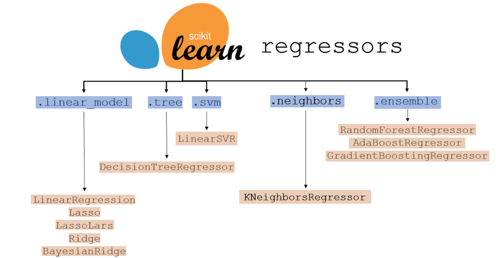

# Regresión



La **regresión** es una técnica de modelado predictivo que evalúa la relación entre las variables dependientes (es decir, la variable objetivo) y las independientes se conoce como análisis de regresión. 

El análisis de regresión se puede utilizar para la previsión, el modelado de series temporales o para encontrar la relación entre las variables y predecir valores continuos. 

## 1. Tipos de regresión
Consultar tabla de [algoritmos](https://airtable.com/shrQ5rfksG64QobIy/tblkAQbukd3Al0OT6).

- Regresión lineal simple
- Regresión lineal multiple o multivariante
- Regresión polinómica
- Regresión regularizada
	-  Regresión Lasso (L1)
	-  Regresión Ridge (L2)
	-  Regresión ElasticNet
- Regresión generalizada
	- PoissonRegressor
	- GammaRegressor
	- TweedieRegressor
- Regresión logística (clasificación)
- Support Vector Regression (SVR)
- Decision tree regression
- Random forest regression


### 1.1. Regresión lineal

La **regresión lineal** es un método estadístico para encontrar la relación entre una variable dependiente y una o más variables independientes. 

Una regresión lineal es un modelo estadístico que nos permite explicar los datos con una recta.

Tres partes que puedes encontrar en cualquier modelo de regresión:

1.  Una o varias **variables de entrada**. (Las variables independientes o **explicativas**) Las que te servirán para predecir el valor de la salida. Normalmente se presenta con la letra “X”.
2.  Normalmente tendrás una **variable de salida** o de **respuesta**. (Es la variable dependiente) La que vas a predecir. Normalmente se utiliza la “y” para representarla.
3.  Y **la función matemática** que se encargará de **relacionar la entrada con la salida**.

Ejemplo de función matemática:

Diabetes = f(Edad)

Para obtener la mejor recta entre los puntos se utiliza la métrica SSE (Sum of Squared Errors). El error o residuo es la distancia que hay entre la recta y cada punto de datos, debería ser el mínimo posible. La suma de todos estos errores debería ser lo más cercana a 0.

#### Correlación

Se trata de ver si existe relación entre dos variables, por ejemplo la diabetes y la edad, sin importar quién es la causa y quien el efecto.

**Correlación de Pearson**: Se utiliza para medir la correlación entre dos variables continuas. (por ejemplo, altura y peso). Es la que utiliza por defecto pandas en el método corr().

**Correlación de Spearman**: se utiliza para medir la correlación entre dos variables clasificadas. (por ejemplo, el rango de la puntuación del examen de matemáticas de un estudiante frente al rango de la puntuación del examen de ciencias en una clase)

**Correlación de Kendall**: se usa cuando desea usar la correlación de Spearman pero el tamaño de la muestra es pequeño y hay muchos rangos empatados.

No es lo mismo que causalidad, la causalidad propone una estructura causa-efecto.


#### Tipos de algoritmos

Algoritmos de optimización utilizados para la Regresión Lineal:

1. **Ecuación normal**

2. **Descenso de gradiente**: recomendable para datasets más grandes ya que computacionalmente es más rápido.
    -   Batch GD: utiliza todo el training dataset y puede ser lento
    -   Stochastic GD: elige una porción aleatoria del dataset. Ej: SGDRegressor
    -   Mini batch GD
    - El descenso de gradiente es un algoritmo de optimización. Modifica los parámetros iterativamente para minimizar la función coste. En cada iteración busca decrementar la función coste, por ejemplo el MSE hasta que el algoritmo converge a un mínimo. Importante: todas las features deben tener una escala similar (StandardScaler).
    - El objetivo principal del algoritmo de descenso de gradiente es minimizar la función de costo. Es uno de los mejores algoritmos de optimización para minimizar errores (diferencia entre el valor real y el valor predicho).

3. **Ordinary Least Squares (OLS)**: recomendable en datasets pequeños, de menos de 104 features.
    -   Utiliza la técnica Singular Value Decomposition (SVD) ← Es el que usa Scikit learn


Es posible usar Grid Search para encontrar el learning rate adecuado, muy bajo tarda en encontrar la solución y muy alto puede nunca converger.


#### Precondiciones para la regresión

Precondiciones para realizar la regresión linear y que todo funcione correctamente:

1.  Outliers: pintar una gráfica de dispersión para comprobar si hay linealidad y que no haya outliers, en caso de que los haya hay que tratarlos.
    -   Gráfico de dispersión
2.  Multivariante norma. Distribución normal, gaussiana.
    1.  Histogramas
    2.  Q-Q plot (Quantile-Quantile Plot)
    3.  Kolmogorov–Smirnov test
    4.  Para corregir el sesgo utilizamos **transformaciones**:
        1.  Box Cox
        2.  Yeo Johnson
3.  Multicolinealidad: relación entre las variables independientes.
    -   Matriz de correlación
    -   VIF
4.  Autocorrelación: Cuando en series temporales un valor está correlacionado con ese mismo valor pero atrás en el tiempo.
    1.  Durbin-Watson’s “d-test”
5.  Homocedasticidad / Heterocedasticidad (homo (igual) y cedasticidad (dispersión)): si la varianza del error de la variable predicha o target se mantiene constante para los diferentes grupos de valores de las variables explicativas o independientes. La varianza mide qué tan dispersos están los datos alrededor de la media. Implica que la varianza de los errores es constante a lo largo del tiempo. Una varianza constante nos permite disponer de modelos más fiables. Además, si una varianza, aparte de ser constante es también más pequeña, nos dará como resultado una predicción del modelo más fiable.
    1.  Goldfeld-Quandt test

#### Ventajas
-   Es sencilla de implementar e interpretar
-   Toma poco tiempo de entrenamiento, incluso con datasets grandes
-   Coeficientes son fáciles de interpretar

#### Desventajas
-   El rendimiento puede verse afectado por la presencia de outliers
-   Asume una relación lineal entre la variable dependiente y la variable independiente lo cual incrementa el error si no es así

### 1.2. Regresión polinómica

Datos no lineales: cuando pintamos un scatter plot y vemos que los puntos no podrían unirse claramente con una línea recta porque están dispersos por varias esquinas.

Cuando tenemos datos que no son lineales, es posible emplear un modelo lineal como por ejemplo la regresión polinómica, que añade potencias a cada feature como si fuera una nueva feature.

Se utiliza `PolynomialFeatures` de scikit. Crea el cuadrado de la feature original como nueva feature y lo usa junto a la feature original. La ventaja es que si hay múltiples features es capaz de encontrar las relaciones entre ellas, por lo que hay que tener cuidado con la explosión combinatoria si se utilizan muchas features. Crea una matriz de features consistente en todas las combinaciones polinómicas con grado menor o igual al especificado:

`model = make_pipeline(PolynomialFeatures(4), lr)`

Para saber si un modelo funciona bien, podemos observar:

-  **overfitting**: cuando el modelo funciona bien sobre datos de entrenamiento pero mal sobre datos reales.
    - Para mejorar un modelo con overfitting se puede añadir más training data hasta que el error obtenido en la validación alcance un error similar al obtenido en el training.
    - Para mejorar el overfitting se regulariza el modelo. La manera más simple es reducir los grados polinómicos.
    
- **underfitting**: cuando el modelo funciona mal en ambos. La solución no es seguir entrenándolo, la solución sería utilizar un modelo más complejo o bien tener mejores features.
    
-   trade-off Bias/variance:
    
    -   Bias es un error de generalización, cuando se asume que los datos son lineales cuando en realidad son cuadráticos. Produce underfitting.
    -   Varianza es exceso de sensibilidad ante pequeñas variaciones en el training data. Por ejemplo un modelo de regresión polinomial con muchos grados.
    -   Incrementar la complejidad del modelo incrementa su varianza y reduce su bias. Reducir la complejidad incrementa su bias y reduce su varianza.
    
### 1.3. Regresión multivariante

La regresión lineal múltiple o multivariante es un caso especial de regresión polinomial, donde el grado del polinomio es 1.

La línea de predicción generada por la regresión simple y lineal suele ser una línea recta. En los casos en que una regresión lineal simple o múltiple no se ajusta con precisión al punto de datos, usamos la regresión lineal polinomial.
    
Cuando tenemos más de una variable independiente entonces la regresión se convierte en regresión multivariante.
    
El primer paso es convertir las variables categóricas.

Después se analiza el VIF (índice para medir la multicolinearidad) para eliminar aquellas features más correlacionadas entre sí.

Después se construye el modelo.

Hay que tratar también los outliers.


### 1.4. Modelos lineales regularizados

La regularización es un tipo de regresión en la que se penalizan las features con el fin de evitar el **overfitting**.

Al aplicar la regularización, se incurre en una penalización por cada variable adicional utilizada para construir el modelo. 

La regularización L1 solicita un modelo con la menor cantidad de predictores posible. Esto es importante para la solidez del modelo: las soluciones simples tienden a ser ciertas en más situaciones. 

La regularización L2 tiene como objetivo mantener la varianza entre los coeficientes de los predictores lo más pequeña posible. La varianza superpuesta entre los predictores dificulta distinguir el impacto real de cada predictor. Evitar que sus varianzas se superpongan aumentará la interpretabilidad. 

Conclusión: la regularización se usa principalmente para evitar que un modelo use demasiadas features y, por lo tanto, evitar el over-fitting. 

-   **Lasso (L1)**: Least Absolute Shrinkage and Selection Operator Regression.
	-   Tiende a eliminar los pesos de las features menos importante, i.e. realiza feature selection automáticamente.
	-   `Lasso(alpha=0.1)`
	-   `SGDRegressor(penalty="l1")`
	
-   **Ridge (L2)**: fuerza al algoritmo a hacer fit con los datos pero también mantener los pesos lo más pequeños posibles. Se puede usar de scikit learn:
	-   `Ridge(alpha=1, solver="cholesky")`
	-   `SGDRegressor(penalty="l2")`

-   **Elastic Net (L1 + L2)**: está a medio camino entre Ridge y Lasso. Preferible elegir Elastic Net en lugar de Lasso. Es una conjunción de la norma L1 + L2.
	-   `ElasticNet(alpha=0.1, l1_ratio=0.5)`
	
-   **Early Stopping**: parar las iteraciones según el error de validación alcanza el mínimo.
	-   `sgd_reg = SGDRegressor(max_iter=1, tol=-np.infty, warm_start=True, penalty=None, learning_rate="constant", eta0=0.0005)`

`alpha` es el hiper-parámetro que controla la fuerza de regularización.


### 1.5. Regresión generalizada

Los modelos lineales generalizados amplían los regresores OLS tradicionales al agregar una función de enlace y asumir diferentes distribuciones para la variable target, siempre que estas distribuciones pertenezcan a la familia exponencial de distribuciones.

Dado que el mundo casi (seguramente) nunca está distribuido normalmente, las tareas de regresión podrían beneficiarse mucho de los nuevos estimadores PoissonRegressor, GammaRegressor y TweedieRegressor en scikit learn: usar esos GLM para datos positivos y sesgados es mucho más apropiado que el método OLS y podría conducir a resultados más adecuados.  

Los modelos lineales generalizados (GLM) se pueden considerar como una generalización del modelo de regresión lineal múltiple.

Al igual que la vida real, los datos del mundo real suelen estar lejos de la normalidad. Aún así, a menudo se asume que los datos, a veces implícitamente, siguen una distribución normal (o gaussiana). Las dos suposiciones más importantes que se hacen al elegir una distribución normal o un error cuadrático para las tareas de regresión son:

* Los datos se distribuyen simétricamente alrededor de la expectativa. Por lo tanto, la expectativa y la mediana son iguales.
* La varianza de los datos no depende de la expectativa.

Además, es bien sabido que es sensible a los valores atípicos. Aquí, queremos señalar que, potencialmente mejores, hay alternativas disponibles.

Las instancias típicas de datos que no se distribuyen normalmente son los recuentos (discretos) o las frecuencias (recuentos por alguna unidad). Para estos, la distribución de Poisson simple podría ser mucho más adecuada.

Los **datos basados en recuentos** (count based data) contienen eventos que ocurren a una velocidad determinada. 

La tasa de ocurrencia puede cambiar con el tiempo o de una observación a la siguiente. Estos son algunos ejemplos de datos basados en recuentos:

* Número de vehículos que cruzan una intersección por hora,
* Número de personas que visitan el consultorio de un médico por mes,
* Número de planetas similares a la Tierra vistos por mes.
* número de pacientes por día en un hospital
* número de personas por día que utilizan su bicicleta
* número de goles marcados por partido y jugador

Un conjunto de datos de recuentos tiene las siguientes características:

* Datos de números enteros: 
	* los datos consisten en números enteros no negativos: ``[0… ∞]`` Las técnicas de regresión como la regresión de mínimos cuadrados ordinarios pueden no ser apropiadas para modelar dichos datos, ya que OLSR funciona mejor en números reales como -656.0, -0.00000345, 13786.1 etc.

* Distribución sesgada: los datos pueden contener una gran cantidad de puntos de datos para solo unos pocos valores, lo que hace que la distribución de frecuencia sea bastante sesgada.

* Escasez: los datos pueden reflejar la ocurrencia de un evento raro, como un estallido de rayos gamma, lo que hace que los datos sean escasos.

* Tasa de ocurrencia: en aras de crear un modelo, se puede suponer que existe una cierta tasa de ocurrencia de eventos λ que impulsa la generación de dichos datos. La tasa de eventos puede variar con el tiempo.

El modelo de regresión de Poisson y el modelo de regresión binomial negativa son dos técnicas populares para desarrollar modelos de regresión para conteos. Otras posibilidades son los modelos logit ordenado, probit ordenado y mínimos cuadrados no lineales.

Es una buena práctica comenzar con el modelo de regresión de Poisson y usarlo como "control" para modelos más complejos o menos restringidos.

los cambios constantes de entrada conducen a cambios en los resultados o salidas que presentan variaciones geométricas (es decir, exponenciales) en lugar de variaciones constantes.  
  
La elección de la distribución depende del problema en cuestión:  
  
* Si los valores objetivo son conteos (valores enteros no negativos) o frecuencias relativas (no negativas), puede usar una desviación de Poisson con enlace de registro.  
* Si los valores objetivo son positivos y están sesgados, puede probar una desviación de Gamma con enlace de registro.  
* Si los valores objetivo parecen tener una cola más pesada que una distribución Gamma, puede probar una desviación gaussiana inversa (o incluso potencias de varianza más altas de la familia Tweedie).  
  
Ejemplos de casos de uso incluyen:  
  
* Modelado agrícola / meteorológico: 
	* número de eventos de lluvia por año (Poisson)
	* cantidad de lluvia por evento (Gamma)
	* precipitación total por año (Tweedie / Compound Poisson Gamma).  

* Modelado de riesgos/tarificación de pólizas de seguro: 
	* número de siniestros/tomador de póliza por año (Poisson)
	* costo por evento (Gamma)
	* costo total por asegurado por año (Tweedie/Compuesto Poisson Gamma).  

* Mantenimiento predictivo: 
	* número de eventos de interrupción de la producción por año (Poisson)
	* duración de la interrupción (Gamma)
	* tiempo total de interrupción por año (Tweedie / Compound Poisson Gamma).

### 1.6. Regresión logística

Warning: a pesar del nombre, se usa para problemas de **clasificación** en vez de problemas de **regresión**.

Es una generalización de la regresión lineal.

Se utiliza para estimar la probabilidad de que una instancia pertenezca a una clase particular (ejemplo si un correo es spam o no).

Al igual que la regresión lineal, calcula la suma de pesos sobre las features de entrada (más el bias term) pero en vez de dar el resultado directamente como ocurre en la regresión lineal, lo que da es la logística de este resultado. La logística es una función sigmoidea que da un número entre 0 y 1.

Convierte la variable cualitativa en una probabilidad, que es cuantitativa, utilizando el operador logístico (logit). De esta forma tiene la misma estructura que una regresión lineal. Después el resultado calcula la inversa del operador logístico y obtiene un porcentaje.

El hiperparámetro que controla la fuerza de regularización no es alpha, es su inversa, `C`. Cuánto más alto sea **C** menos regularizado está el modelo.

La regresión logística se puede generalizar para soportar múltiples clases directamente, lo que da lugar a **Softmax Regression o Multinomial Logistic Regression**. Solo predicen una clase al mismo tiempo, es decir, es multiclase pero no multiouput. Por ejemplo puedes reconocer diferentes clases de plantas, pero no al mismo tiempo. Se crea como:

`softmax_reg = LogisticRegression(multi_class="multinomial",solver="lbfgs", C=10)`


## 2. Métricas para la regresión

![[metrics.png]]
Para evaluar los resultados de la regresión se pueden emplear distintas métricas.

https://scikit-learn.org/stable/modules/model_evaluation.html#regression-metrics

### 1. R²

```python
from sklearn.metrics import r2_score
y = [3, -0.5, 2, 7]
y_pred = [2.5, 0.0, 2, 8]

print("R2: ", r2_score(y, y_pred))

# output
# R2: 0.9486081370449679
```

**R-squared (R²)** **(R cuadrado) (Coeficiente de determinación)** explica en qué medida la varianza de una variable explica la varianza de la segunda variable. En otras palabras, mide la proporción de varianza de la **variable dependiente** explicada por la **variable independiente**.

Es una métrica popular para identificar la precisión del modelo. Indica qué tan cerca están los puntos de datos de la línea ajustada generada por un algoritmo de regresión. 

Un valor mayor de R cuadrado indica un mejor ajuste. Esto nos ayuda a encontrar la relación entre la variable independiente hacia la variable dependiente.

La puntuación de R² varía de 0 a 1:

* Cuanto más cerca de 1 esté el R², mejor será el modelo de regresión. 
* Si R² es igual a 0, el modelo no funciona mejor que un modelo aleatorio. 
* Si R² es negativo, el modelo de regresión es erróneo.

Cuando agregamos nuevas características en nuestros datos, la puntuación R2 comienza a aumentar o se mantiene constante, pero nunca disminuye porque asume que al agregar más datos, la variación de los datos aumenta.

Pero el problema es que cuando agregamos una característica irrelevante en el conjunto de datos, en ese momento R2 a veces comienza a aumentar, lo cual es incorrecto.

Para calcularlo se utiliza:

* SSR: Sum Square Residual
* SST: Sum Square Total

**¿Es bueno un R cuadrado alto?**

Si el R-cuadrado del conjunto de entrenamiento es más alto y el R-cuadrado del conjunto de validación es mucho más bajo, indica sobreajuste (overfitting). 

Si el mismo R-cuadrado alto se traduce también en el conjunto de validación, entonces podemos decir que el modelo se ajusta bien.

**¿Es malo un R cuadrado bajo?**

Esto depende completamente del tipo de problema que se está resolviendo. En algunos problemas que son difíciles de modelar, incluso un R-cuadrado de 0,5 puede considerarse bueno. 

No existe una regla general para confirmar que el R-cuadrado sea bueno o malo. Sin embargo, un R-cuadrado muy bajo indica un ajuste insuficiente (underfitting) y agregar características relevantes adicionales o usar un modelo complejo podría ayudar.

### 2. R² ajustado

```python
import pandas as pd
from sklearn.linear_model import LinearRegression  
from sklearn.metrics import r2_score

df = pd.read_csv("data/cars.csv")  
  
model = LinearRegression()  
X, y = df[["mpg", "wt", "drat", "qsec"]], df.hp  
model.fit(X, y)  

y_pred = model.predict(X)  
r2 = r2_score(y, y_pred)  
  
r2_adj = 1 - (1 - r2) * (len(y) - 1) / (len(y) - X.shape[1] - 1)  
print(r2_adj)

# output
# 0.7787005290062519
```

El **R² ajustado** es el mismo que el R² estándar, excepto que penaliza a los modelos cuando se agregan features adicionales.

Para contrarrestar el problema al que se enfrenta el R-cuadrado, el R-cuadrado ajustado penaliza la adición de más variables independientes que no aumentan el poder explicativo del modelo de regresión.

El valor de r-cuadrado ajustado siempre es menor o igual que el valor de r-cuadrado.

Va de 0 a 1, cuanto más cerca esté el valor de 1, mejor será.

Mide la variación explicada únicamente por las variables independientes que realmente afectan a la variable dependiente.

Se calcula como:

``R2 ajustado = 1 – [(1-R2)*(n-1)/(n-k-1)]``

donde:

* R2: El R2 del modelo
* n: El número de observaciones
* k: El número de variables independientes (features)

### 3. MSE

```python
from sklearn.metrics import mean_squared_error
y = [3, -0.5, 2, 7]
y_pred = [2.5, 0.0, 2, 8]

print("Mean Squared Error: ", mean_squared_error(y, y_pred))

# output
# Mean Squared Error: 0.375
```

El **error cuadrático medio (MSE)  (Mean Squared Error)** es el promedio de las diferencias al cuadrado entre los valores real y predichos.

Cuanto menor sea el valor, mejor será el modelo de regresión.

Si tiene valores atípicos en el conjunto de datos, los penaliza más y el MSE calculado es mayor. Entonces, en resumen, no es robusto a los valores atípicos que fueron una ventaja en MAE.

MSE utiliza la operación cuadrada para eliminar el signo de cada valor de error y penalizar errores grandes.

A medida que tomamos el cuadrado del error, el efecto de los errores más grandes se vuelve más pronunciado que el error más pequeño, por lo tanto, el modelo ahora puede enfocarse más en los errores más grandes.

Problemas:

* Si hacemos una sola predicción muy mala, el cuadrado empeorará el error y puede sesgar la métrica para **sobrestimar** la ineficiencia del modelo.
* Si todos los errores son pequeños, o mejor dicho, menores que 1, entonces podemos **subestimar** la ineficiencia del modelo.


### 4. RMSE

```python
from sklearn.metrics import mean_squared_error
y = [3, -0.5, 2, 7]
y_pred = [2.5, 0.0, 2, 8]

print("Root Mean Squared Error: ", mean_squared_error(y, y_pred, squared=False))

# output
# Root Mean Squared Error: 0.6123724356957945
```

Otra forma de obtenerlo:

```python
import numpy as np
from sklearn.metrics import mean_squared_error

y = [3, -0.5, 2, 7]
y_pred = [2.5, 0.0, 2, 8]

print("Root Mean Squared Error: ", np.sqrt(mean_squared_error(y, y_pred)))

# output
# Root Mean Squared Error: 0.6123724356957945
```

La **raíz cuadrada del Error cuadrático medio (RMSE) (Root Mean Squared Error)** es la diferencia media cuadrática entre el valor real y el valor predicho.

Queremos que el valor de RMSE sea lo más bajo posible, cuanto más bajo sea el valor de RMSE, mejor será el modelo con sus predicciones. Un RMSE más alto indica que hay grandes desviaciones entre el valor previsto y el real.

Indica cómo de cerca están los valores predichos a los valores reales.


### 5. MAE 

```python
from sklearn.metrics import mean_absolute_error
y = [3, -0.5, 2, 7]
y_pred = [2.5, 0.0, 2, 8]

print("Mean Absolute Error: ", mean_absolute_error(y, y_pred))
# output
# Mean Absolute Error: 0.5
```

Es la media del valor absoluto de los errores, es decir, predichos - actuales.

El **error absoluto medio (MAE) (Mean Absolute Error)** es el promedio de las diferencias absolutas entre el valor real y el valor predicho del modelo.

Si no tomamos los valores absolutos, la diferencia negativa cancelará la diferencia positiva y nos quedará un cero al realizar la suma.

* Un MAE de 0 significa que su modelo es un predictor perfecto de las salidas, aunque podría ser síntoma de overfitting.
* Un MAE pequeño sugiere que el modelo es bueno para la predicción.
* Un MAE grande sugiere que su modelo puede tener problemas en ciertas áreas. 

El error absoluto medio (MAE) tiene la misma unidad que los datos originales y solo se puede comparar entre modelos cuyos errores se miden en las mismas unidades.

Cuanto mayor sea el MAE, más crítico es el error. Es robusto a valores atípicos. Por lo tanto, al tomar los valores absolutos, MAE puede tratar con los valores atípicos.

Aquí, un gran error  no eclipsa a muchos errores pequeños y, por lo tanto, el resultado nos brinda una comprensión relativamente imparcial de cómo se está desempeñando el modelo. Por lo tanto, no castiga los términos de error más grandes.

Ejemplo dataset tips: El error de 0.70 en las predicciones indica que de media, cada tip predicho está 0.70$ por encima o por debajo del valor real.

### 6. Error máximo

```python
from sklearn.metrics import max_error
y = [3, -0.5, 2, 7]
y_pred = [2.5, 0.0, 2, 8]

print("Max Error: ", max_error(y_ y_pred))
# output
# Max Error: 1.0
```

La función max_error calcula el error residual máximo, una métrica que captura el peor de los casos de error entre el valor predicho y el valor real. 

En un modelo de regresión de salida única perfectamente ajustado, max_error sería 0 en el conjunto de entrenamiento y, aunque esto sería muy poco probable en el mundo real, esta métrica muestra el grado de error que tenía el modelo cuando se ajustó.


### Métricas en Scikit-learn
> [!DANGER]
>   Interpretación en scikit-learn:
>   
>   Scikit devuelve el neg_mean_squared_error o NMSE para seguir la convención de 'el valor más alto es mejor'. 
>   
>   So if a model gives you a MAE of say 0.55 and another model gives you a MAE of say 0.78, their NMAE values would be flipped as -0.55 and -0.78 and by following the convention of higher the better, we pick the former model which results has a higher NMAE of -0.55.


